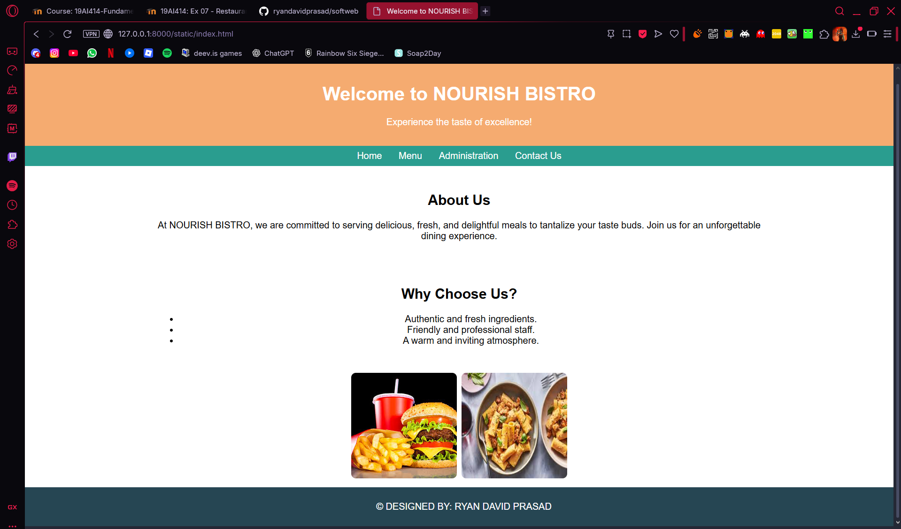
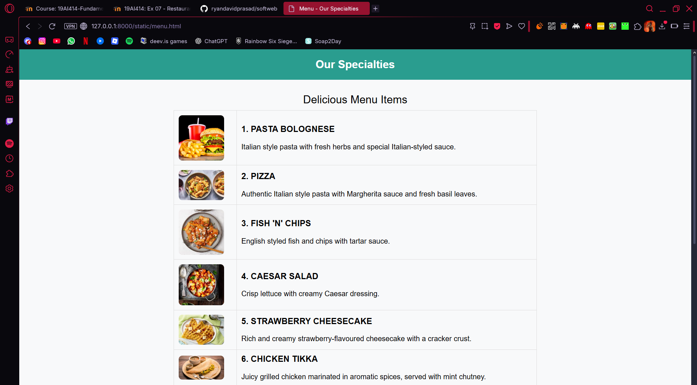
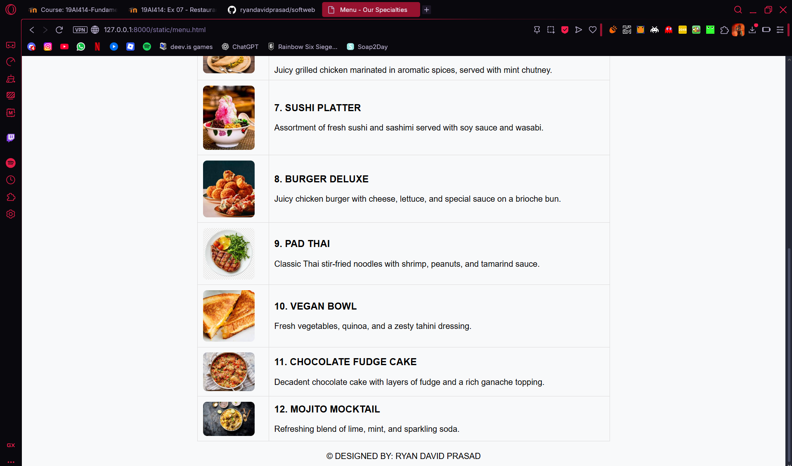
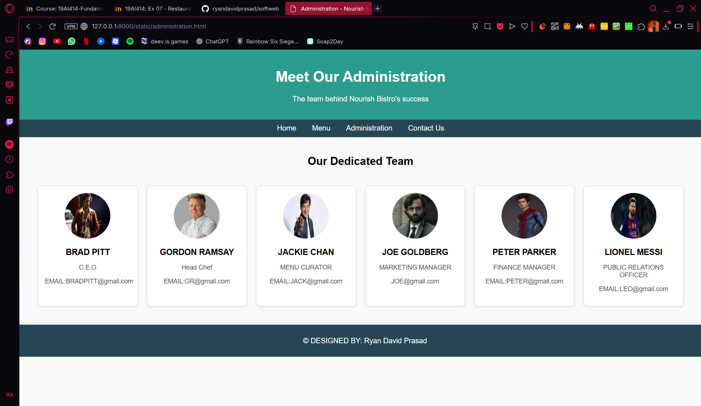
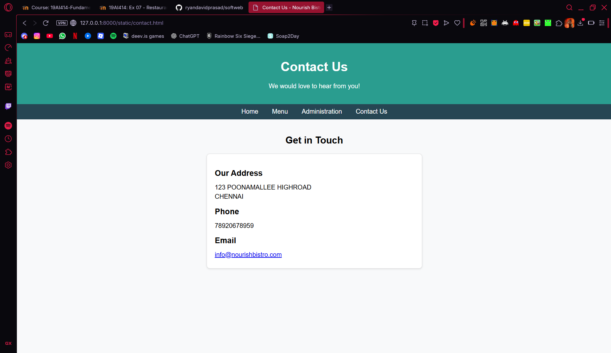

# Ex.07 Restuarant Website
## Date:15/11/25

## AIM:
To develop a static Resturant website to display the menu and services provided by the resturant.

## DESIGN STEPS:

### Step 1:
Requirement collection.

### Step 2:
Creating the layout using HTML and CSS.

### Step 3:
Updating the sample content.

### Step 4:
Choose the appropriate style and color scheme.

### Step 5:
Validate the layout in various browsers.

### Step 6:
Validate the HTML code.

### Step 7:
Publish the website in the given URL.

## PROGRAM:
```html
index.html
<html>
<head>
    <meta charset="UTF-8">
    <meta name="viewport" content="width=device-width, initial-scale=1.0">
    <title>Welcome to NOURISH BISTRO</title>
    <style>
        body {
            font-family: Arial, sans-serif;
            margin: 0;
            padding: 0;
            text-align: center;
            background-image: url('back.jpg');
            background-size: cover;
            background-attachment: fixed;
        }
        .banner {
            background-color: rgba(244, 162, 97, 0.9);
            padding: 15px;
            color: white;
        }
        .nav-links {
            list-style-type: none;
            padding: 0;
            background-color: #2a9d8f;
            margin: 0;
            overflow: hidden;
        }
        .nav-links li {
            display: inline;
            margin: 0;
        }
        .nav-links a {
            display: inline-block;
            padding: 8px 12px;
            color: white;
            text-decoration: none;
        }
        .nav-links a:hover {
            background-color: #264653;
        }
        .welcome-section, .features-section {
            padding: 15px;
            background-color: rgba(255, 255, 255, 0.8);
            margin: 10px auto;
            width: 70%;
            border-radius: 8px;
        }
        footer {
            background-color: #264653;
            color: white;
            padding: 8px;
            position: relative;
            bottom: 0;
            width: 100%;
        }
        .food-images {
            display: flex;
            justify-content: center;
            gap: 8px;
            margin: 15px 0;
        }
        .food-images img {
            width: 180px;
            height: auto;
            border-radius: 8px;
        }
    </style>
</head>
<body>
    <!-- Header Section -->
    <div class="banner">
        <h1>Welcome to NOURISH BISTRO</h1>
        <p>Experience the taste of excellence!</p>
    </div>

    <!-- Navigation Bar -->
    <ul class="nav-links">
        <li><a href="index.html">Home</a></li>
        <li><a href="menu.html">Menu</a></li>
        <li><a href="administration.html">Administration</a></li>
        <li><a href="contact.html">Contact Us</a></li>
    </ul>

    <!-- Main Content Section -->
    <div class="welcome-section">
        <h2>About Us</h2>
        <p>At NOURISH BISTRO, we are committed to serving delicious, fresh, and delightful meals to tantalize your taste buds. Join us for an unforgettable dining experience.</p>
    </div>

    <div class="features-section">
        <h2>Why Choose Us?</h2>
        <ul>
            <li>Authentic and fresh ingredients.</li>
            <li>Friendly and professional staff.</li>
            <li>A warm and inviting atmosphere.</li>
        </ul>
    </div>

    <!-- Food Images Section -->
    <div class="food-images">
        
        
    </div>

    <!-- Footer Section -->
    <footer>
        <p>&copy; DESIGNED BY: RYAN DAVID PRASAD</p>
    </footer>
</body>
</html>
administration.html
<html>
<head>
    <meta charset="UTF-8">
    <meta name="viewport" content="width=device-width, initial-scale=1.0">
    <title>Administration - Nourish Bistro</title>
    <style>
        body {
            font-family: Arial, sans-serif;
            margin: 0;
            padding: 0;
            text-align: center;
            background-color: #f8f9fa;
        }
        .banner {
            background-color: #2a9d8f;
            padding: 20px;
            color: white;
        }
        .nav-links {
            list-style-type: none;
            padding: 0;
            background-color: #264653;
            margin: 0;
            overflow: hidden;
        }
        .nav-links li {
            display: inline;
        }
        .nav-links a {
            display: inline-block;
            padding: 10px 15px;
            color: white;
            text-decoration: none;
        }
        .nav-links a:hover {
            background-color: #2a9d8f;
        }
        .admin-section {
            padding: 20px;
        }
        .admin-grid {
            display: grid;
            grid-template-columns: repeat(auto-fit, minmax(200px, 1fr));
            gap: 20px;
            padding: 20px;
        }
        .admin-card {
            background-color: white;
            border: 1px solid #ddd;
            border-radius: 8px;
            padding: 15px;
            box-shadow: 0 2px 4px rgba(0, 0, 0, 0.1);
            text-align: center;
        }
        .admin-card img {
            width: 100px;
            height: 100px;
            border-radius: 50%;
            margin-bottom: 10px;
        }
        .admin-card h3 {
            font-size: 18px;
            margin: 10px 0;
        }
        .admin-card p {
            font-size: 14px;
            color: #555;
        }
        footer {
            background-color: #264653;
            color: white;
            padding: 10px;
            position: relative;
            bottom: 0;
            width: 100%;
        }
    </style>
</head>
<body>
    <!-- Header Section -->
    <div class="banner">
        <h1>Meet Our Administration</h1>
        <p>The team behind Nourish Bistro's success</p>
    </div>

    <!-- Navigation Bar -->
    <ul class="nav-links">
        <li><a href="index.html">Home</a></li>
        <li><a href="menu.html">Menu</a></li>
        <li><a href="administration.html">Administration</a></li>
        <li><a href="contact.html">Contact Us</a></li>
    </ul>

    <!-- Administration Section -->
    <div class="admin-section">
        <h2>Our Dedicated Team</h2>
        <div class="admin-grid">
            <div class="admin-card">
                
                <h3>BRAD PITT</h3>
                <p>C.E.O</p>
                <p>EMAIL:BRADPITT@gmail.com</p>
            </div>
            <div class="admin-card">
                
                <h3>GORDON RAMSAY</h3>
                <p>Head Chef</p>
                <p>EMAIL:GR@gmail.com</p>
            </div>
            <div class="admin-card">
                
                <h3>JACKIE CHAN</h3>
                <p>MENU CURATOR</p>
                <p>EMAIL:JACK@gmail.com</p>
            </div>
            <div class="admin-card">
                
                <h3>JOE GOLDBERG</h3>
                <p>MARKETING MANAGER</p>
                <p>JOE@gmail.com</p>
            </div>
            <div class="admin-card">
                
                <h3>PETER PARKER</h3>
                <p>FINANCE MANAGER</p>
                <p>EMAIL:PETER@gmail.com</p>
            </div>
            <div class="admin-card">
                
                <h3>LIONEL MESSI</h3>
                <p>PUBLIC RELATIONS OFFICER</p>
                <p>EMAIL:LEO@gmail.com</p>
            </div>
        </div>
    </div>
</body>
<!-- Footer Section -->
<footer>
    <p>&copy; DESIGNED BY: Ryan David Prasad</p>
</footer>
</html>
contact.html
<!DOCTYPE html>
<html>
<head>
    <meta charset="UTF-8">
    <meta name="viewport" content="width=device-width, initial-scale=1.0">
    <title>Contact Us - Nourish Bistro</title>
    <style>
        body {
            font-family: Arial, sans-serif;
            margin: 0;
            padding: 0;
            text-align: center;
            background-color: #f8f9fa;
        }
        .banner {
            background-color: #2a9d8f;
            padding: 20px;
            color: white;
        }
        .nav-links {
            list-style-type: none;
            padding: 0;
            background-color: #264653;
            margin: 0;
            overflow: hidden;
        }
        .nav-links li {
            display: inline;
        }
        .nav-links a {
            display: inline-block;
            padding: 10px 15px;
            color: white;
            text-decoration: none;
        }
        .nav-links a:hover {
            background-color: #2a9d8f;
        }
        .contact-section {
            padding: 20px;
        }
        .contact-details {
            background-color: white;
            border: 1px solid #ddd;
            border-radius: 8px;
            padding: 20px;
            box-shadow: 0 2px 4px rgba(0, 0, 0, 0.1);
            margin: 20px auto;
            max-width: 500px;
            text-align: left;
        }
        .contact-details h2 {
            font-size: 20px;
            margin-bottom: 15px;
        }
        .contact-details p {
            font-size: 16px;
            margin: 5px 0;
        }
        footer {
            background-color: #264653;
            color: white;
            padding: 10px;
            position: relative;
            bottom: 0;
            width: 100%;
        }
    </style>
</head>
<body>
    <!-- Header Section -->
    <div class="banner">
        <h1>Contact Us</h1>
        <p>We would love to hear from you!</p>
    </div>

    <!-- Navigation Bar -->
    <ul class="nav-links">
        <li><a href="index.html">Home</a></li>
        <li><a href="menu.html">Menu</a></li>
        <li><a href="administration.html">Administration</a></li>
        <li><a href="contact.html">Contact Us</a></li>
    </ul>

    <!-- Contact Section -->
    <div class="contact-section">
        <h2>Get in Touch</h2>
        <div class="contact-details">
            <h2>Our Address</h2>
            <p>123 POONAMALLEE HIGHROAD</p>
            <p>CHENNAI</p>

            <h2>Phone</h2>
            <p>78920678959</p>

            <h2>Email</h2>
            <p><a href="mailto:info@nourishbistro.com">info@nourishbistro.com</a></p>
        </div>
    </div>
</body>
</html>
menu.html
<html>
<head>
    <meta charset="UTF-8">
    <meta name="viewport" content="width=device-width, initial-scale=1.0">
    <title>Menu - Our Specialties</title>
    <style>
        body {
            font-family: Arial, sans-serif;
            margin: 0;
            padding: 0;
            text-align: center;
            background-color: #f8f9fa;
        }
        h2 {
            background-color: #2a9d8f;
            color: white;
            padding: 20px;
        }
        table {
            width: 100%;
            max-width: 800px;
            margin: 20px auto;
            border-collapse: collapse;
        }
        th, td {
            padding: 10px;
            border: 1px solid #ddd;
            text-align: left;
        }
        img {
            width: 100px;
            height: auto;
            border-radius: 8px;
        }
        caption {
            font-size: 1.5em;
            margin: 10px 0;
        }
    </style>
</head>
<body>
    <h2>Our Specialties</h2>
    <table>
        <caption>Delicious Menu Items</caption>
        <tr>
            <td></td>
            <td>
                <h3>1. PASTA BOLOGNESE</h3>
                <p>Italian style pasta with fresh herbs and special Italian-styled sauce.</p>
            </td>
        </tr>
        <tr>
            <td></td>
            <td>
                <h3>2. PIZZA</h3>
                <p>Authentic Italian style pasta with Margherita sauce and fresh basil leaves.</p>
            </td>
        </tr>
        <tr>
            <td></td>
            <td>
                <h3>3. FISH 'N' CHIPS</h3>
                <p>English styled fish and chips with tartar sauce.</p>
            </td>
        </tr>
        <tr>
            <td></td>
            <td>
                <h3>4. CAESAR SALAD</h3>
                <p>Crisp lettuce with creamy Caesar dressing.</p>
            </td>
        </tr>
        <tr>
            <td></td>
            <td>
                <h3>5. STRAWBERRY CHEESECAKE</h3>
                <p>Rich and creamy strawberry-flavoured cheesecake with a cracker crust.</p>
            </td>
        </tr>
        <tr>
            <td></td>
            <td>
                <h3>6. CHICKEN TIKKA</h3>
                <p>Juicy grilled chicken marinated in aromatic spices, served with mint chutney.</p>
            </td>
        </tr>
        <tr>
            <td></td>
            <td>
                <h3>7. SUSHI PLATTER</h3>
                <p>Assortment of fresh sushi and sashimi served with soy sauce and wasabi.</p>
            </td>
        </tr>
        <tr>
            <td></td>
            <td>
                <h3>8. BURGER DELUXE</h3>
                <p>Juicy chicken burger with cheese, lettuce, and special sauce on a brioche bun.</p>
            </td>
        </tr>
        <tr>
            <td></td>
            <td>
                <h3>9. PAD THAI</h3>
                <p>Classic Thai stir-fried noodles with shrimp, peanuts, and tamarind sauce.</p>
            </td>
        </tr>
        <tr>
            <td></td>
            <td>
                <h3>10. VEGAN BOWL</h3>
                <p>Fresh vegetables, quinoa, and a zesty tahini dressing.</p>
            </td>
        </tr>
        <tr>
            <td></td>
            <td>
                <h3>11. CHOCOLATE FUDGE CAKE</h3>
                <p>Decadent chocolate cake with layers of fudge and a rich ganache topping.</p>
            </td>
        </tr>
        <tr>
            <td></td>
            <td>
                <h3>12. MOJITO MOCKTAIL</h3>
                <p>Refreshing blend of lime, mint, and sparkling soda.</p>
            </td>
        </tr>
    </table>
    <!-- Footer Section -->
    <footer>
        <p>&copy; DESIGNED BY: RYAN DAVID PRASAD</p>
    </footer>
</body>
</html>

```

## OUTPUT:





## RESULT:
The program for designing software company website using HTML and CSS is completed successfully.
